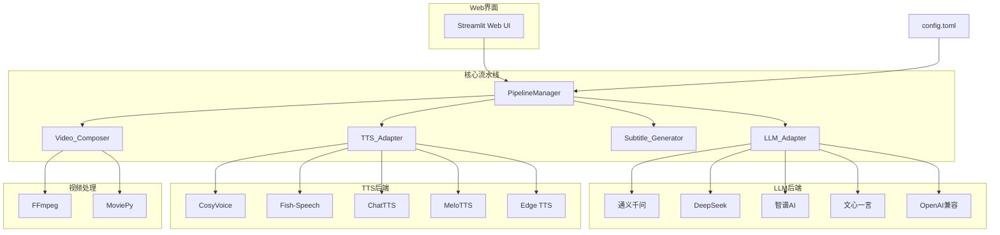

# 设计文档：图片转短视频解说工具

## 概述

本工具采用模块化流水线架构，将图片转短视频的流程拆分为四个核心阶段：图片输入 → AI解说词生成 → 语音合成 → 视频合成。每个阶段通过适配器模式支持多种后端，使用TOML配置文件管理模型参数。前端采用Streamlit构建Web界面，后端使用Python实现所有处理逻辑。

技术栈：
- 语言：Python 3.10+
- Web框架：Streamlit
- 视频处理：FFmpeg + MoviePy
- 配置管理：TOML（tomli/tomli-w）
- HTTP客户端：httpx（异步）
- 包管理：pip + requirements.txt

## 架构



整体采用分层架构：

1. **表现层**：Streamlit Web界面，负责用户交互
2. **编排层**：PipelineManager，协调各模块按顺序执行
3. **服务层**：LLM_Adapter、TTS_Adapter、Subtitle_Generator、Video_Composer
4. **基础设施层**：FFmpeg、MoviePy、httpx、配置文件

## 组件与接口

### 1. PipelineManager（流水线管理器）

负责编排整个处理流程，管理任务状态。

```python
from dataclasses import dataclass, field
from enum import Enum
from pathlib import Path

class TaskStatus(Enum):
    PENDING = "pending"
    RUNNING = "running"
    COMPLETED = "completed"
    FAILED = "failed"

@dataclass
class TaskContext:
    task_id: str
    images: list[Path]
    aspect_ratio: str  # "9:16" 或 "16:9"
    llm_provider: str
    llm_model: str      # 用户选择的LLM模型名称
    tts_provider: str
    tts_voice: str
    bgm_path: Path | None = None
    narration: str = ""
    audio_path: Path | None = None
    subtitle_data: list[dict] | None = None
    output_path: Path | None = None
    status: TaskStatus = TaskStatus.PENDING
    error: str = ""
    progress: float = 0.0

class PipelineManager:
    def __init__(self, config: dict):
        """根据配置初始化各适配器"""
        ...

    async def run(self, ctx: TaskContext) -> TaskContext:
        """执行完整流水线：解说词生成 → 语音合成 → 字幕生成 → 视频合成"""
        ...

    async def run_batch(self, tasks: list[TaskContext],
                        on_progress: Callable | None = None) -> list[TaskContext]:
        """批量执行多个任务，单个失败不影响其他任务"""
        ...
```

### 2. LLM_Adapter（大模型适配器）

通过统一接口调用不同的多模态大模型生成解说词。

```python
from abc import ABC, abstractmethod

class BaseLLMProvider(ABC):
    @abstractmethod
    async def generate_narration(self, images: list[Path], prompt: str) -> str:
        """根据图片生成解说词"""
        ...

class OpenAICompatibleProvider(BaseLLMProvider):
    """兼容OpenAI API格式的通用Provider，适用于通义千问、DeepSeek、智谱AI等"""

    def __init__(self, api_base: str, api_key: str, model: str):
        ...

    async def generate_narration(self, images: list[Path], prompt: str) -> str:
        """将图片编码为base64，通过多模态API发送请求"""
        ...

class WenxinProvider(BaseLLMProvider):
    """百度文心一言，使用独立的鉴权和API格式"""

    def __init__(self, api_key: str, secret_key: str, model: str):
        ...

    async def generate_narration(self, images: list[Path], prompt: str) -> str:
        ...

class LLMAdapter:
    """LLM适配器，根据配置选择Provider，支持动态选择模型名称"""

    # 每个provider支持的模型列表（可在配置文件中扩展）
    DEFAULT_MODELS = {
        "qwen": ["qwen-vl-max", "qwen-vl-plus", "qwen-vl-max-latest"],
        "deepseek": ["deepseek-chat", "deepseek-reasoner"],
        "glm": ["glm-4v", "glm-4v-plus", "glm-4v-flash"],
        "wenxin": ["ernie-bot-4", "ernie-bot-turbo", "ernie-4.0-8k"],
        "openai_compatible": [],  # 用户自定义
    }

    PROVIDERS = {
        "qwen": lambda cfg, model: OpenAICompatibleProvider(
            api_base="https://dashscope.aliyuncs.com/compatible-mode/v1",
            api_key=cfg["api_key"], model=model),
        "deepseek": lambda cfg, model: OpenAICompatibleProvider(
            api_base="https://api.deepseek.com/v1",
            api_key=cfg["api_key"], model=model),
        "glm": lambda cfg, model: OpenAICompatibleProvider(
            api_base="https://open.bigmodel.cn/api/paas/v4",
            api_key=cfg["api_key"], model=model),
        "wenxin": lambda cfg, model: WenxinProvider(
            api_key=cfg["api_key"], secret_key=cfg["secret_key"],
            model=model),
        "openai_compatible": lambda cfg, model: OpenAICompatibleProvider(
            api_base=cfg["api_base"], api_key=cfg["api_key"],
            model=model),
    }

    def __init__(self, config: dict):
        ...

    def get_provider(self, name: str, model: str | None = None) -> BaseLLMProvider:
        """获取指定provider实例，model参数可覆盖配置中的默认模型"""
        ...

    def list_models(self, provider_name: str) -> list[str]:
        """返回指定provider支持的模型列表，合并默认列表和配置文件中的自定义列表"""
        ...

    def list_providers(self) -> list[str]:
        """返回所有已配置（api_key非空）的provider名称列表"""
        ...
```

### 3. TTS_Adapter（语音合成适配器）

通过统一接口调用不同的TTS后端。

```python
@dataclass
class TTSResult:
    audio_path: Path
    duration: float  # 音频时长（秒）
    sample_rate: int

class BaseTTSProvider(ABC):
    @abstractmethod
    async def synthesize(self, text: str, voice: str, output_path: Path) -> TTSResult:
        """将文本合成为音频文件"""
        ...

    @abstractmethod
    def list_voices(self) -> list[dict]:
        """返回可用音色列表，每项包含 id, name, language"""
        ...

class CosyVoiceProvider(BaseTTSProvider):
    """CosyVoice TTS，通过本地API或远程服务调用"""
    ...

class FishSpeechProvider(BaseTTSProvider):
    """Fish-Speech TTS"""
    ...

class ChatTTSProvider(BaseTTSProvider):
    """ChatTTS"""
    ...

class MeloTTSProvider(BaseTTSProvider):
    """MeloTTS"""
    ...

class EdgeTTSProvider(BaseTTSProvider):
    """Edge TTS，作为兜底方案，使用edge-tts库"""
    ...

class TTSAdapter:
    """TTS适配器，支持自动回退到Edge TTS，支持动态选择音色"""

    PROVIDERS = {
        "cosyvoice": CosyVoiceProvider,
        "fish_speech": FishSpeechProvider,
        "chattts": ChatTTSProvider,
        "melotts": MeloTTSProvider,
        "edge_tts": EdgeTTSProvider,
    }

    def __init__(self, config: dict):
        ...

    async def synthesize(self, text: str, provider_name: str,
                         voice: str, output_path: Path) -> TTSResult:
        """合成语音，失败时自动回退到Edge TTS"""
        ...

    def list_providers(self) -> list[str]:
        """返回所有已配置的TTS provider名称列表"""
        ...

    def list_voices(self, provider_name: str) -> list[dict]:
        """返回指定provider的可用音色列表，每项包含id, name, language"""
        ...
```

### 4. Subtitle_Generator（字幕生成器）

根据解说词文本和语音时长生成字幕数据。

```python
@dataclass
class SubtitleSegment:
    index: int
    start_time: float  # 秒
    end_time: float    # 秒
    text: str

@dataclass
class SubtitleStyle:
    font_family: str = "Microsoft YaHei"
    font_size: int = 36
    color: str = "#FFFFFF"
    outline_color: str = "#000000"
    outline_width: int = 2
    position: str = "bottom"  # 字幕位置

class SubtitleGenerator:
    MAX_CHARS_PER_LINE: int = 15  # 每行最大中文字符数

    def generate(self, text: str, total_duration: float) -> list[SubtitleSegment]:
        """根据文本和总时长生成字幕段落列表"""
        ...

    def split_text(self, text: str) -> list[str]:
        """按标点符号和语义边界分割文本，每段不超过MAX_CHARS_PER_LINE个字符"""
        ...

    def assign_timestamps(self, segments: list[str],
                          total_duration: float) -> list[SubtitleSegment]:
        """按字符数比例分配每段字幕的起止时间"""
        ...
```

### 5. Video_Composer（视频合成器）

将图片、音频、字幕、背景音乐合成为最终视频。

```python
@dataclass
class VideoConfig:
    aspect_ratio: str = "9:16"
    width: int = 1080
    height: int = 1920
    fps: int = 30
    bitrate: str = "4M"
    codec: str = "libx264"

@dataclass
class KenBurnsParams:
    zoom_range: tuple[float, float] = (1.0, 1.3)
    pan_speed: float = 0.02
    fade_duration: float = 0.5  # 淡入淡出时长（秒）

class VideoComposer:
    def compose(self, ctx: TaskContext, video_config: VideoConfig,
                ken_burns: KenBurnsParams, subtitle_style: SubtitleStyle) -> Path:
        """合成最终视频"""
        ...

    def create_image_clips(self, images: list[Path], durations: list[float],
                           video_config: VideoConfig,
                           ken_burns: KenBurnsParams) -> list:
        """为每张图片创建带Ken Burns效果的视频片段"""
        ...

    def add_subtitles(self, video_clip, subtitles: list[SubtitleSegment],
                      style: SubtitleStyle):
        """将字幕硬编码到视频上"""
        ...

    def mix_audio(self, narration_path: Path, bgm_path: Path | None,
                  video_duration: float, bgm_volume: float = 0.25) -> Path:
        """混合解说语音和背景音乐"""
        ...

    def calculate_image_durations(self, image_count: int,
                                  total_duration: float) -> list[float]:
        """根据图片数量和总时长计算每张图片的展示时长"""
        ...
```

### 6. ConfigManager（配置管理器）

```python
class ConfigManager:
    DEFAULT_CONFIG_PATH = Path("config.toml")

    def __init__(self, path: Path | None = None):
        ...

    def load(self) -> dict:
        """加载TOML配置文件"""
        ...

    def save(self, config: dict) -> None:
        """保存配置到TOML文件"""
        ...

    def validate(self, config: dict) -> list[str]:
        """校验配置完整性，返回缺失字段列表"""
        ...
```

## 数据模型

### 配置文件结构（config.toml）

```toml
[general]
output_dir = "./output"
temp_dir = "./temp"
default_aspect_ratio = "9:16"

[llm.qwen]
api_key = ""
default_model = "qwen-vl-max"
models = ["qwen-vl-max", "qwen-vl-plus", "qwen-vl-max-latest"]

[llm.deepseek]
api_key = ""
default_model = "deepseek-chat"
models = ["deepseek-chat", "deepseek-reasoner"]

[llm.glm]
api_key = ""
default_model = "glm-4v"
models = ["glm-4v", "glm-4v-plus", "glm-4v-flash"]

[llm.wenxin]
api_key = ""
secret_key = ""
default_model = "ernie-bot-4"
models = ["ernie-bot-4", "ernie-bot-turbo", "ernie-4.0-8k"]

[llm.openai_compatible]
api_base = ""
api_key = ""
default_model = ""
models = []  # 用户自行添加模型名称

[llm.prompt_template]
default = """你是一位专业的短视频解说文案创作者。请根据以下图片内容，生成一段{style}风格的解说词。
要求：
- 时长约{duration}秒
- 语气{tone}
- 适合短视频平台发布
- 每张图片对应一段解说"""

[tts.cosyvoice]
api_base = "http://localhost:9880"
default_voice = "中文女"

[tts.fish_speech]
api_base = "http://localhost:8080"
default_voice = "default"

[tts.chattts]
api_base = "http://localhost:9966"

[tts.melotts]
api_base = "http://localhost:8888"

[tts.edge_tts]
default_voice = "zh-CN-XiaoxiaoNeural"

[video]
default_bitrate = "4M"
default_fps = 30
codec = "libx264"
bgm_volume = 0.25
fade_duration = 0.5

[subtitle]
font_family = "Microsoft YaHei"
font_size = 36
color = "#FFFFFF"
outline_color = "#000000"
outline_width = 2
max_chars_per_line = 15
```

### 项目目录结构

```
image-to-video-narrator/
├── app.py                    # Streamlit入口
├── config.toml               # 配置文件
├── requirements.txt          # Python依赖
├── src/
│   ├── __init__.py
│   ├── pipeline.py           # PipelineManager
│   ├── config_manager.py     # ConfigManager
│   ├── llm/
│   │   ├── __init__.py
│   │   ├── base.py           # BaseLLMProvider
│   │   ├── adapter.py        # LLMAdapter
│   │   ├── openai_compat.py  # OpenAICompatibleProvider
│   │   └── wenxin.py         # WenxinProvider
│   ├── tts/
│   │   ├── __init__.py
│   │   ├── base.py           # BaseTTSProvider, TTSResult
│   │   ├── adapter.py        # TTSAdapter（含回退逻辑）
│   │   ├── cosyvoice.py
│   │   ├── fish_speech.py
│   │   ├── chattts.py
│   │   ├── melotts.py
│   │   └── edge_tts_provider.py
│   ├── video/
│   │   ├── __init__.py
│   │   ├── composer.py       # VideoComposer
│   │   └── ken_burns.py      # Ken Burns效果实现
│   └── subtitle/
│       ├── __init__.py
│       └── generator.py      # SubtitleGenerator
└── tests/
    ├── __init__.py
    ├── test_subtitle.py
    ├── test_video.py
    ├── test_llm_adapter.py
    ├── test_tts_adapter.py
    └── test_config.py
```

## 正确性属性

*正确性属性是系统在所有有效执行中都应保持为真的特征或行为——本质上是关于系统应该做什么的形式化陈述。属性是人类可读规范与机器可验证正确性保证之间的桥梁。*

### Property 1: 文件格式验证正确性

*对于任意*文件输入，如果文件扩展名为JPG、PNG或WEBP之一，系统应接受该文件；否则系统应拒绝该文件并返回包含格式信息的错误提示。

**Validates: Requirements 1.1, 1.3**

### Property 2: 图片顺序保持不变量

*对于任意*一组图片和任意排列顺序，经过Pipeline处理后，图片在视频中的出现顺序应与用户指定的顺序完全一致。

**Validates: Requirements 1.2**

### Property 3: 适配器注册完整性

*对于任意*在PROVIDERS字典中声明的provider名称（LLM: qwen, deepseek, glm, wenxin, openai_compatible; TTS: cosyvoice, fish_speech, chattts, melotts, edge_tts），给定有效配置后，get_provider方法应返回对应的Provider实例且不抛出异常。

**Validates: Requirements 2.2, 3.2**

### Property 4: 提示词模板渲染完整性

*对于任意*模板参数组合（style、duration、tone），渲染后的提示词文本应包含所有参数的实际值。

**Validates: Requirements 2.3**

### Property 5: TTS输出格式合规性

*对于任意*成功的TTS合成结果，输出文件的扩展名应为.wav或.mp3，且TTSResult中的duration应大于0。

**Validates: Requirements 3.3**

### Property 6: TTS回退机制可靠性

*对于任意*TTS provider调用失败的场景，TTSAdapter应自动使用Edge TTS重新合成，最终返回有效的TTSResult而非抛出异常。

**Validates: Requirements 3.5**

### Property 7: 画面比例分辨率映射

*对于任意*画面比例选择（"9:16"或"16:9"），VideoConfig生成的宽高值应分别为(1080, 1920)或(1920, 1080)。

**Validates: Requirements 4.2**

### Property 8: 图片展示时长分配不变量

*对于任意*正整数图片数量N和正浮点数总时长T，calculate_image_durations(N, T)返回的时长列表应满足：列表长度等于N，每个时长大于0，所有时长之和等于T。

**Validates: Requirements 4.4**

### Property 9: 字幕时间轴覆盖与无重叠

*对于任意*非空文本和正浮点数总时长，SubtitleGenerator.generate()返回的字幕段落列表应满足：第一段起始时间为0，最后一段结束时间等于总时长，相邻段落无时间间隙且不重叠。

**Validates: Requirements 5.1**

### Property 10: 字幕分行长度限制

*对于任意*中文文本输入，SubtitleGenerator.split_text()返回的每个分段长度应不超过15个中文字符。

**Validates: Requirements 5.4**

### Property 11: BGM音量混合比例

*对于任意*音量混合参数，背景音乐的混合音量系数应在0.20到0.30之间（含边界）。

**Validates: Requirements 6.2**

### Property 12: BGM循环播放时长匹配

*对于任意*BGM时长小于视频时长的场景，混合后的音频总时长应等于视频时长。

**Validates: Requirements 6.3**

### Property 13: 配置文件Round-Trip一致性

*对于任意*有效配置字典，执行save()后再load()应得到与原始配置等价的字典。

**Validates: Requirements 7.1**

### Property 14: 配置校验缺失字段检测

*对于任意*缺少一个或多个必要字段的配置字典，validate()方法返回的缺失字段列表应恰好包含所有被移除的字段名称。

**Validates: Requirements 7.2**

### Property 15: 批量任务隔离性

*对于任意*批量任务列表（其中部分任务被设定为会失败），run_batch()执行后，所有任务都应有最终状态（COMPLETED或FAILED），失败任务不应阻止其他任务完成，且完成任务数加失败任务数等于总任务数。

**Validates: Requirements 8.2, 8.4**

## 错误处理

### LLM调用错误

| 错误场景 | 处理方式 |
|---------|---------|
| API密钥无效 | 返回明确的认证错误信息，提示用户检查配置 |
| 请求超时 | 设置30秒超时，超时后返回错误并允许重试 |
| 模型不支持多模态 | 捕获错误，提示用户选择支持vision的模型 |
| 速率限制 | 捕获429状态码，等待后自动重试（最多3次） |

### TTS合成错误

| 错误场景 | 处理方式 |
|---------|---------|
| TTS服务不可用 | 自动回退到Edge TTS，通知用户 |
| 音色不存在 | 返回错误，提示可用音色列表 |
| 文本过长 | 自动分段合成，拼接音频 |

### 视频合成错误

| 错误场景 | 处理方式 |
|---------|---------|
| FFmpeg未安装 | 启动时检测，给出安装指引 |
| 图片无法读取 | 跳过损坏图片，记录警告 |
| 磁盘空间不足 | 合成前检查可用空间，空间不足时提前报错 |
| 编码失败 | 记录详细错误日志，返回错误信息 |

### 配置错误

| 错误场景 | 处理方式 |
|---------|---------|
| 配置文件不存在 | 自动生成默认配置文件模板 |
| 配置格式错误 | 解析失败时报告具体行号和错误原因 |
| 必要字段缺失 | 列出所有缺失字段名称 |

## 测试策略

### 双重测试方法

本项目采用单元测试与属性测试相结合的策略：

- **单元测试**：验证具体示例、边界情况和错误条件
- **属性测试**：验证在所有有效输入上都应成立的通用属性

两者互补：单元测试捕获具体bug，属性测试验证通用正确性。

### 属性测试配置

- 测试框架：pytest + hypothesis
- 每个属性测试最少运行100次迭代
- 每个测试用注释标注对应的设计文档属性编号
- 标注格式：**Feature: image-to-video-narrator, Property {number}: {property_text}**
- 每个正确性属性对应一个独立的属性测试函数

### 测试范围

| 模块 | 单元测试 | 属性测试 |
|------|---------|---------|
| 文件格式验证 | 测试具体格式的接受/拒绝 | Property 1: 格式验证正确性 |
| 图片排序 | 测试空列表、单图片 | Property 2: 顺序保持 |
| LLM适配器 | 测试各provider实例化、mock API调用 | Property 3: 注册完整性 |
| 提示词模板 | 测试默认模板渲染 | Property 4: 模板渲染完整性 |
| TTS适配器 | 测试各provider实例化、回退场景 | Property 5, 6: 输出格式、回退机制 |
| 视频配置 | 测试默认值 | Property 7: 比例映射 |
| 时长计算 | 测试边界值（1张图、极短时长） | Property 8: 时长分配不变量 |
| 字幕生成 | 测试空文本、纯标点 | Property 9, 10: 时间轴覆盖、分行限制 |
| 音频混合 | 测试无BGM场景 | Property 11, 12: 音量比例、循环播放 |
| 配置管理 | 测试默认配置生成 | Property 13, 14: Round-trip、缺失检测 |
| 批量处理 | 测试全成功、全失败 | Property 15: 任务隔离性 |

### 外部依赖Mock策略

- LLM API调用：使用httpx mock或respx库模拟API响应
- TTS服务：mock HTTP调用，返回预生成的音频数据
- FFmpeg：对于集成测试使用实际FFmpeg，单元测试中mock subprocess调用
- 文件系统：使用tmp_path fixture创建临时目录
