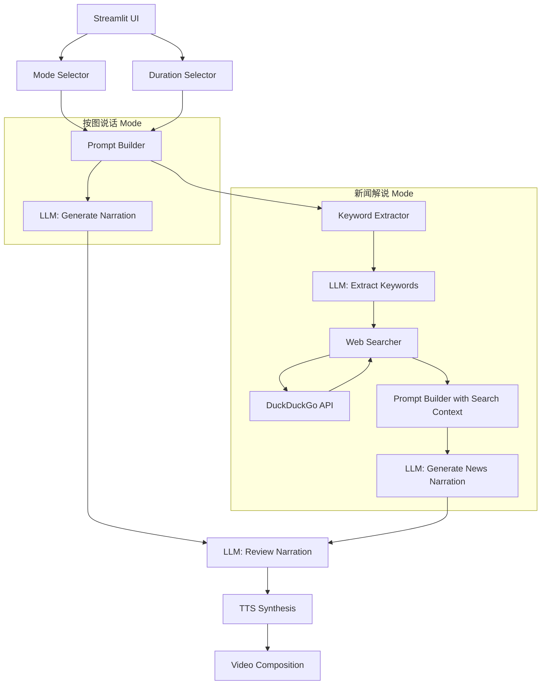

# Design Document: Narration Modes

## Overview

本设计为图片转短视频解说工具新增解说模式选择（按图说话 / 新闻解说）和视频时长选择功能。核心变更包括：

1. UI 层新增模式选择器和时长选择器
2. 新增关键词提取模块（复用现有 LLM 基础设施）
3. 新增网络搜索模块（使用 DuckDuckGo 免费搜索 API）
4. 扩展提示词构建逻辑以支持多模式和时长参数
5. 扩展流水线以编排新闻解说模式的多步骤流程
6. 扩展配置文件以支持搜索相关设置

设计原则：最小化对现有代码的侵入，通过新增模块和扩展现有接口实现功能。

## Architecture



### 模块职责

- **Narration Mode Selector (UI)**: 在步骤2渲染模式选择 radio，将选择存入 session_state
- **Duration Selector (UI)**: 在步骤2渲染时长选择 selectbox，将选择存入 session_state
- **Keyword Extractor (`src/llm/keyword_extractor.py`)**: 调用 LLM 从图片中提取关键词
- **Web Searcher (`src/search/web_searcher.py`)**: 调用 DuckDuckGo API 搜索关键词，返回结构化结果
- **Prompt Builder (`src/llm/prompt_builder.py`)**: 根据模式、时长、图片数量、搜索结果构建提示词
- **Pipeline Manager (扩展)**: 编排新闻解说模式的多步骤流程

## Components and Interfaces

### 1. NarrationMode 枚举

```python
# src/narration_mode.py
from enum import Enum

class NarrationMode(str, Enum):
    DESCRIBE_IMAGES = "describe_images"  # 按图说话
    NEWS_COMMENTARY = "news_commentary"  # 新闻解说
```

### 2. Keyword Extractor

```python
# src/llm/keyword_extractor.py
class KeywordExtractor:
    """从图片中提取新闻关键词。"""
    
    def __init__(self, llm_provider: BaseLLMProvider):
        self._provider = llm_provider
    
    async def extract(self, images: list[Path]) -> list[str]:
        """发送图片到 LLM，提取 3-10 个关键词。
        
        Returns:
            关键词字符串列表。提取失败时返回空列表。
        """
        ...
```

提取提示词设计：
```
请仔细观察这些图片，提取其中与新闻事件相关的关键词。
要求：
1. 提取3到10个关键词
2. 关键词应该是具体的人名、地名、事件名、机构名等
3. 按以下JSON格式返回：{"keywords": ["关键词1", "关键词2", ...]}
4. 只返回JSON，不要其他内容
```

### 3. Web Searcher

```python
# src/search/web_searcher.py
@dataclass
class SearchResult:
    title: str
    snippet: str
    url: str

class WebSearcher:
    """使用 DuckDuckGo API 搜索网络信息。"""
    
    def __init__(self, timeout: float = 10.0, max_results: int = 10):
        self._timeout = timeout
        self._max_results = max_results
    
    async def search(self, keywords: list[str]) -> list[SearchResult]:
        """根据关键词搜索网络，返回结构化结果。
        
        搜索失败时返回空列表并记录警告日志。
        """
        ...
    
    def format_for_prompt(self, results: list[SearchResult]) -> str:
        """将搜索结果序列化为适合 LLM 提示词的文本格式。"""
        ...
```

搜索实现方案：使用 DuckDuckGo HTML 搜索（通过 `duckduckgo-search` Python 包），无需 API Key，免费可用。将关键词用空格连接作为搜索查询。

### 4. Prompt Builder

```python
# src/llm/prompt_builder.py
class PromptBuilder:
    """根据模式和参数构建 LLM 提示词。"""
    
    def build(
        self,
        mode: NarrationMode,
        image_count: int,
        duration: int,
        search_context: str = "",
        style: str = "专业自信",
        tone: str = "沉稳可靠、有说服力",
    ) -> str:
        """构建完整的 LLM 提示词。
        
        所有模式都使用 JSON 模板格式输出。
        按图说话模式使用推广风格提示词。
        新闻解说模式包含搜索上下文并使用新闻风格提示词。
        """
        ...
```

按图说话模式提示词模板（保持现有逻辑）：
```
我是一个内容创作者，我需要你帮我写解说词，我会用这些解说词直接去生成配音视频。
所以你只需要给我纯解说词文本，不要给我任何推荐、建议、解释或额外内容。

我给你{image_count}张图片，请根据每张图片上的文字内容，以我本人的口吻（第一人称'我'）写解说词。
总时长约{duration}秒，风格{style}，语气{tone}。

按以下JSON格式填写value，不要修改key：
{json_template}
```

新闻解说模式提示词模板：
```
我是一个新闻解说员，我需要你帮我写新闻解说词，我会用这些解说词直接去生成配音视频。
所以你只需要给我纯解说词文本，不要给我任何推荐、建议、解释或额外内容。

我给你{image_count}张新闻相关图片。请结合图片内容和以下网络搜索到的相关新闻信息，
以新闻解说员的口吻写解说词。总时长约{duration}秒，风格客观专业，语气沉稳权威。

【相关新闻参考】
{search_context}

要求：
1. 结合图片内容和新闻参考信息进行解说
2. 保持新闻报道的客观性和专业性
3. 如果搜索信息与图片不相关，以图片内容为主

按以下JSON格式填写value，不要修改key：
{json_template}
```

### 5. LLM Adapter 扩展

扩展 `LLMAdapter.render_prompt()` 方法，增加 `mode` 和 `search_context` 参数。为保持向后兼容，新参数均有默认值。实际上，新的 `PromptBuilder` 类将承担提示词构建职责，`LLMAdapter` 将委托给 `PromptBuilder`。

### 6. Pipeline Manager 扩展

扩展 `TaskContext` 数据类，新增字段：

```python
@dataclass
class TaskContext:
    # ... existing fields ...
    narration_mode: NarrationMode = NarrationMode.DESCRIBE_IMAGES
    target_duration: int = 60  # 目标时长（秒）
    search_results: list[dict] | None = None  # 搜索结果
```

扩展 `PipelineManager.run()` 方法，在生成解说词前根据模式执行关键词提取和网络搜索。

### 7. UI 变更

在 `_render_step_narration()` 函数中，在"生成解说词"按钮之前添加：

```python
# 解说模式选择
mode = st.radio(
    "解说模式",
    options=["按图说话", "新闻解说"],
    captions=["根据图片内容直接生成解说词，适合商业推广、个人品牌等", 
              "结合网络搜索生成新闻风格解说词，适合新闻报道、时事评论等"],
    horizontal=True,
    key="narration_mode_radio",
)

# 视频时长选择
duration = st.selectbox(
    "目标视频时长",
    options=[30, 60, 90, 120, 180],
    format_func=lambda d: f"{d} 秒",
    index=1,  # 默认60秒
    key="duration_select",
)
```

### 8. 配置扩展

在 `config.toml` 的 `DEFAULT_CONFIG` 中新增：

```toml
[search]
engine = "duckduckgo"
timeout = 10.0
max_results = 10

[general]
# ... existing fields ...
default_narration_mode = "describe_images"
default_duration = 60
```

## Data Models

### SearchResult

| 字段 | 类型 | 说明 |
|------|------|------|
| title | str | 搜索结果标题 |
| snippet | str | 搜索结果摘要 |
| url | str | 搜索结果链接 |

### NarrationMode

| 值 | 说明 |
|----|------|
| describe_images | 按图说话模式 |
| news_commentary | 新闻解说模式 |

### TaskContext 扩展字段

| 字段 | 类型 | 默认值 | 说明 |
|------|------|--------|------|
| narration_mode | NarrationMode | DESCRIBE_IMAGES | 解说模式 |
| target_duration | int | 60 | 目标视频时长（秒） |
| search_results | list[dict] \| None | None | 网络搜索结果 |

### 配置扩展

| 配置路径 | 类型 | 默认值 | 说明 |
|----------|------|--------|------|
| search.engine | str | "duckduckgo" | 搜索引擎 |
| search.timeout | float | 10.0 | 搜索超时（秒） |
| search.max_results | int | 10 | 最大搜索结果数 |
| general.default_narration_mode | str | "describe_images" | 默认解说模式 |
| general.default_duration | int | 60 | 默认视频时长（秒） |


## Correctness Properties

*A property is a characteristic or behavior that should hold true across all valid executions of a system—essentially, a formal statement about what the system should do. Properties serve as the bridge between human-readable specifications and machine-verifiable correctness guarantees.*

### Property 1: Prompt always contains target duration

*For any* valid narration mode (describe_images or news_commentary) and *for any* valid target duration (30, 60, 90, 120, 180), the prompt produced by PromptBuilder.build() SHALL contain the string representation of that duration.

**Validates: Requirements 2.3, 6.3**

### Property 2: Prompt always contains JSON template

*For any* valid narration mode, *for any* valid target duration, and *for any* positive image count, the prompt produced by PromptBuilder.build() SHALL be non-empty and contain a valid JSON template with keys `narration_1` through `narration_{image_count}`.

**Validates: Requirements 5.4, 6.4, 6.5**

### Property 3: Keyword parsing produces string list from valid JSON

*For any* valid JSON string containing a `"keywords"` key with a list of strings (length 0-20), KeywordExtractor's parsing logic SHALL return a list of strings. For any invalid or empty input string, the parsing logic SHALL return an empty list.

**Validates: Requirements 3.2, 3.3**

### Property 4: Search result count is bounded

*For any* list of raw search results of arbitrary length, WebSearcher SHALL return at most `max_results` (default 10) SearchResult items.

**Validates: Requirements 4.4**

### Property 5: Search result serialization contains all result information

*For any* non-empty list of SearchResult objects, WebSearcher.format_for_prompt() SHALL produce a non-empty string that contains the title and snippet of every SearchResult in the input list.

**Validates: Requirements 4.5**

### Property 6: News mode prompt includes search context

*For any* non-empty search context string, when PromptBuilder.build() is called with mode=NEWS_COMMENTARY and that search context, the resulting prompt SHALL contain the search context string.

**Validates: Requirements 5.1**

### Property 7: Search result parsing extracts title and snippet

*For any* valid search API response item containing title and snippet fields, WebSearcher's parsing logic SHALL produce a SearchResult with matching title and snippet values.

**Validates: Requirements 4.2**

## Error Handling

### Keyword Extraction Failures

- LLM 返回空响应或无法解析的 JSON → `KeywordExtractor.extract()` 返回空列表，记录 warning 日志
- LLM 请求超时或网络错误 → 同上，返回空列表

### Web Search Failures

- 搜索 API 请求超时（默认 10 秒）→ `WebSearcher.search()` 返回空列表，记录 warning 日志
- 搜索 API 返回非 200 状态码 → 同上
- 搜索结果解析失败 → 跳过该条结果，继续处理其余结果

### Pipeline Fallback

- 新闻解说模式下，关键词提取失败 → 使用空关键词列表，跳过搜索，回退到仅基于图片的新闻风格解说
- 新闻解说模式下，网络搜索失败 → 使用空搜索结果，回退到仅基于图片的新闻风格解说
- 所有回退场景均记录 warning 日志，不中断流水线

### 配置缺失

- 配置文件缺少 `[search]` 段 → 使用默认值（engine=duckduckgo, timeout=10.0, max_results=10）
- 配置文件缺少 `general.default_narration_mode` → 默认使用 describe_images
- 配置文件缺少 `general.default_duration` → 默认使用 60

## Testing Strategy

### 测试框架

- 单元测试：`pytest`
- 属性测试：`hypothesis`（Python 属性测试库）
- 每个属性测试最少运行 100 次迭代

### 单元测试

单元测试覆盖具体示例和边界情况：

1. **PromptBuilder 单元测试**
   - 按图说话模式生成的提示词包含推广风格指令
   - 新闻解说模式生成的提示词包含新闻风格指令
   - 新闻解说模式无搜索结果时的回退提示词

2. **KeywordExtractor 单元测试**
   - 正常 JSON 响应解析
   - 空响应处理
   - 非 JSON 响应处理

3. **WebSearcher 单元测试**
   - 搜索 API 超时处理
   - 搜索 API 错误状态码处理
   - 空关键词列表处理

4. **NarrationMode 单元测试**
   - 枚举值正确性
   - 模式选择路由逻辑

5. **配置扩展单元测试**
   - 新配置字段的默认值
   - 配置验证逻辑

### 属性测试

每个属性测试对应设计文档中的一个 Correctness Property，使用 `hypothesis` 库生成随机输入。

- **Feature: narration-modes, Property 1: Prompt always contains target duration** — 生成随机模式和时长组合，验证提示词包含时长
- **Feature: narration-modes, Property 2: Prompt always contains JSON template** — 生成随机模式、时长和图片数量，验证提示词包含 JSON 模板
- **Feature: narration-modes, Property 3: Keyword parsing produces string list from valid JSON** — 生成随机关键词列表 JSON 和无效字符串，验证解析行为
- **Feature: narration-modes, Property 4: Search result count is bounded** — 生成随机长度的搜索结果列表，验证输出不超过上限
- **Feature: narration-modes, Property 5: Search result serialization contains all result information** — 生成随机 SearchResult 列表，验证序列化结果包含所有标题和摘要
- **Feature: narration-modes, Property 6: News mode prompt includes search context** — 生成随机搜索上下文字符串，验证新闻模式提示词包含该上下文
- **Feature: narration-modes, Property 7: Search result parsing extracts title and snippet** — 生成随机搜索响应项，验证解析结果匹配
